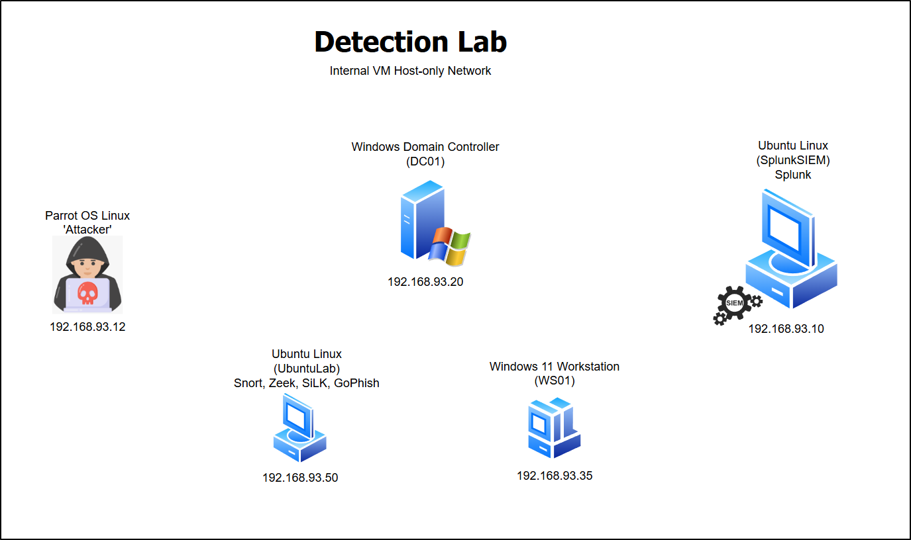

<h2>Detection Lab Architecture</h2>

  

<h3>Splunk, Snort, Zeek, SiLK, and other tools used in a small Windows / Linux VM homelab to show detections.</h3>
<h3>This lab simulates attacker behavior and detection pipelines using endpoint and network telemetry.</h3>
